

# 🎬 Cinematy

### A bilingual Flutter cinema booking & operations platform

**Flutter** · **Supabase** · **PostgreSQL** · **Cubit/BLoC** · **Realtime Reconciliation**

> **Advanced Development · Release Hardening**

 

A single-cinema platform connecting customer booking, staff admission, concessions, administration, and reporting through server-authoritative transactional workflows.

---

> [!IMPORTANT]
> **UI Concept Notice**  
> The visuals in this repository are high-fidelity case-study concepts created to represent implemented workflows and the intended product direction. They are **not current production screenshots**. All displayed names, booking codes, totals, QR codes, and operational data are synthetic presentation data.

> [!NOTE]
> **Private Source**  
> The production implementation remains private. This public repository is an engineering case study containing only sanitized architecture, workflow explanations, concept visuals, and verified technical evidence.

---

## Overview

Cinematy is a **single-cinema booking and operations system** built around three application roles:

- **Customer** — movie discovery, showtimes, seat selection, booking, payment, tickets, concessions.
- **Staff** — ticket admission, internal bookings, counter/concession operations, active order handling.
- **Admin** — halls, seats, movies, showtimes, menus, bookings, role-restricted configuration, and reporting.

The implemented product uses **Flutter** for customer mobile flows and staff/admin web surfaces, backed by **Supabase, PostgreSQL, TypeScript/Deno Edge Functions, Paymob, and Firebase-related notification infrastructure**.

The strongest engineering focus is not the number of screens; it is keeping **finite seat inventory, delayed payment callbacks, staff actions, live state, and historical reporting consistent across multiple operational channels**.

---

## Product Walkthrough

### Customer Experience

#### Movie details → Showtime → Seat selection

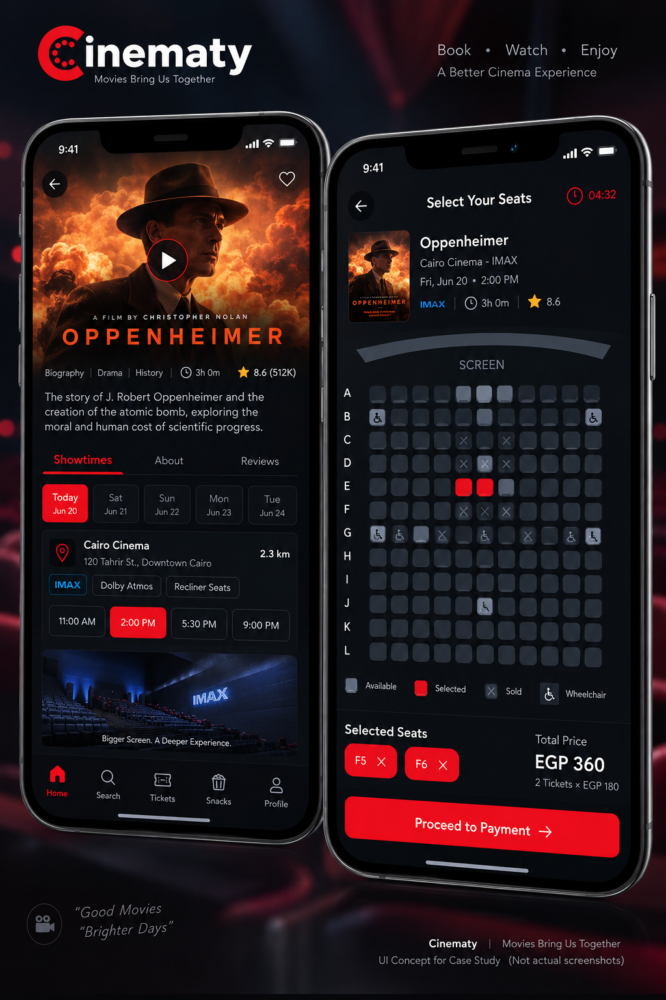

#### Booking confirmation & digital ticket

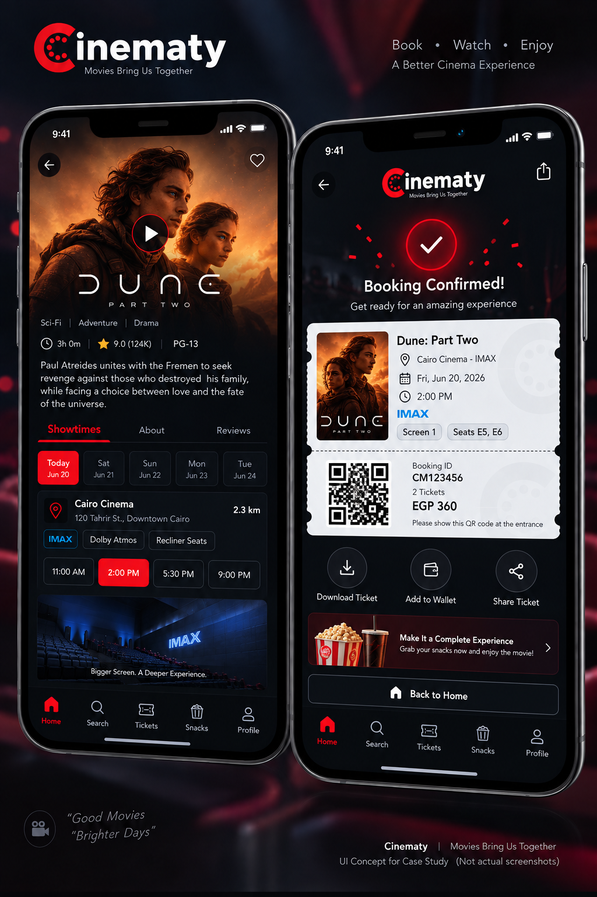

#### Seat selection → Payment

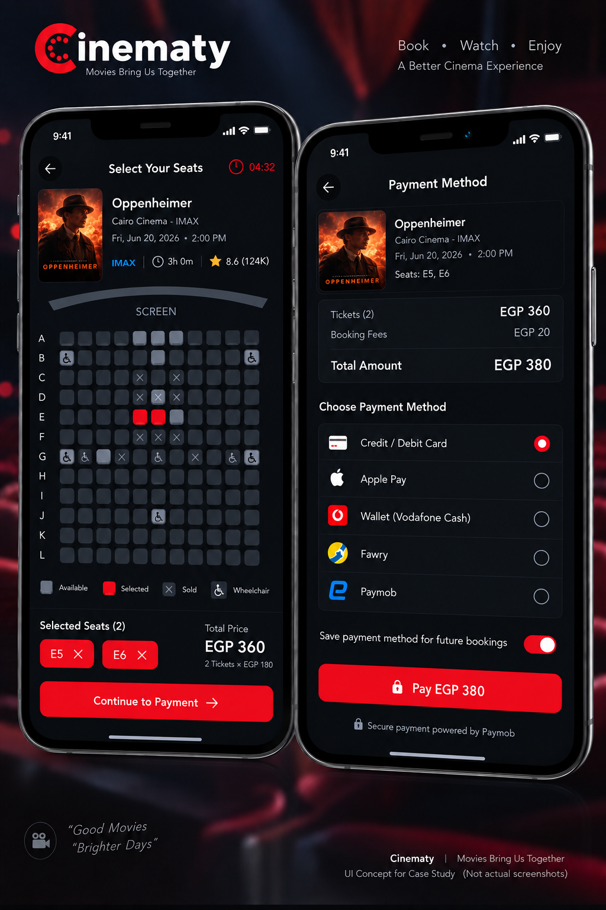

> The payment screen above is a **visual concept**. The verified implementation evidence supports the Paymob-based online payment workflow; additional payment methods shown in the concept must not be interpreted as implemented integrations.

---

### Admin Experience

#### Operations dashboard

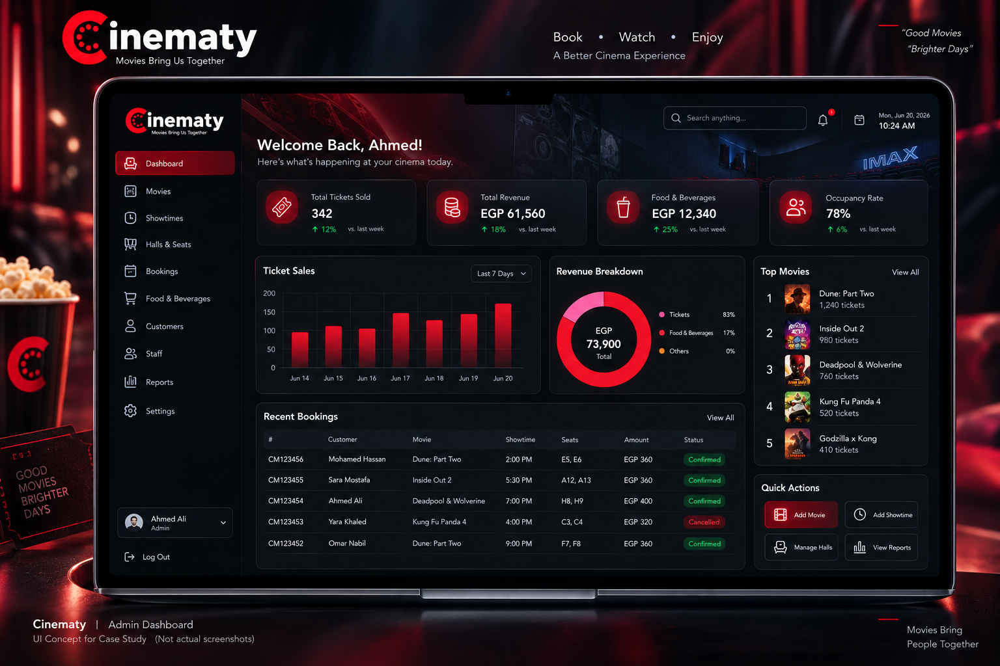

#### Movie management

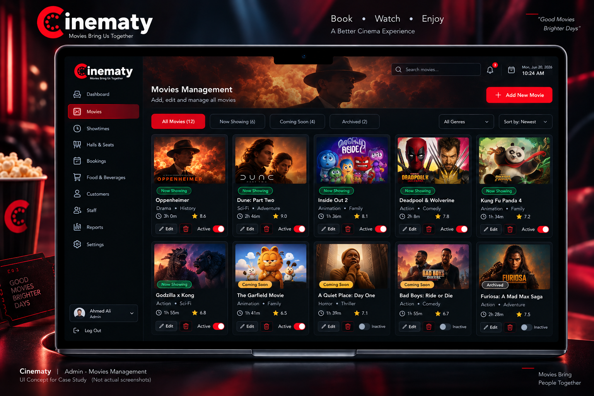

#### Showtime management

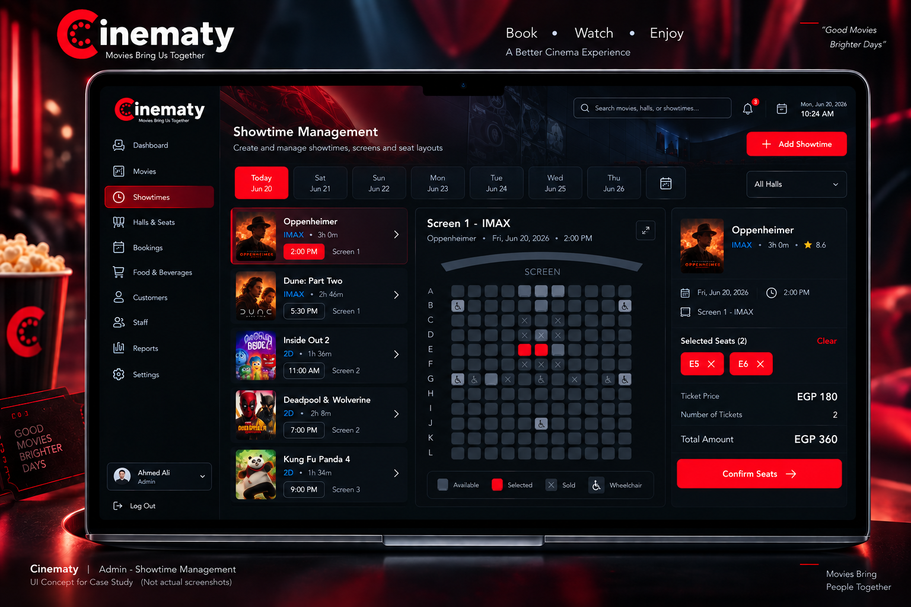

#### Food & beverage administration

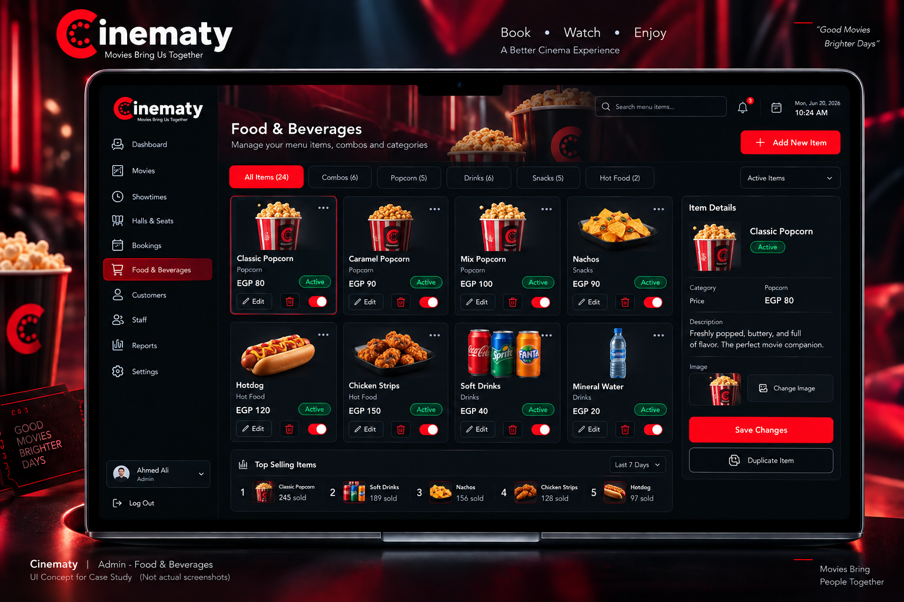

#### Booking management

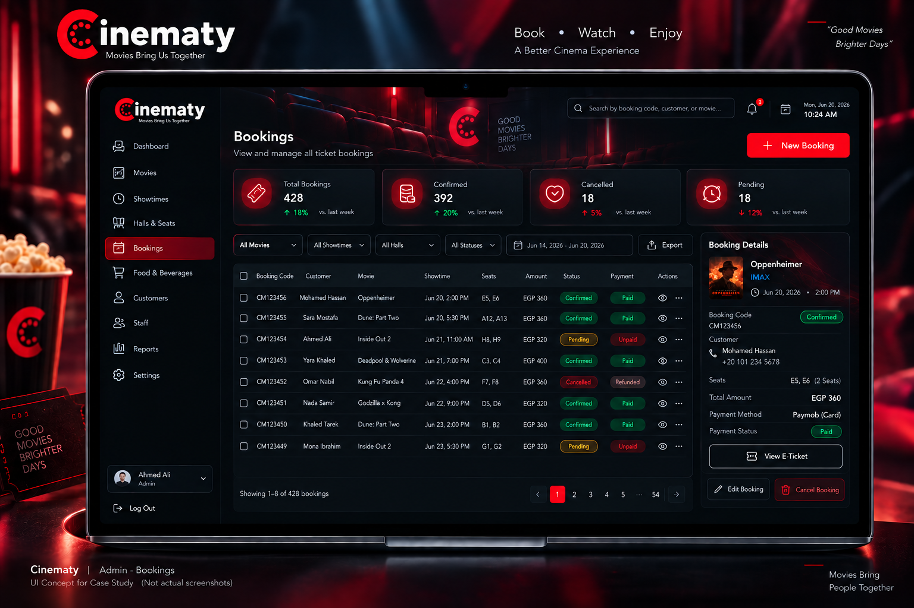

#### Reports & analytics

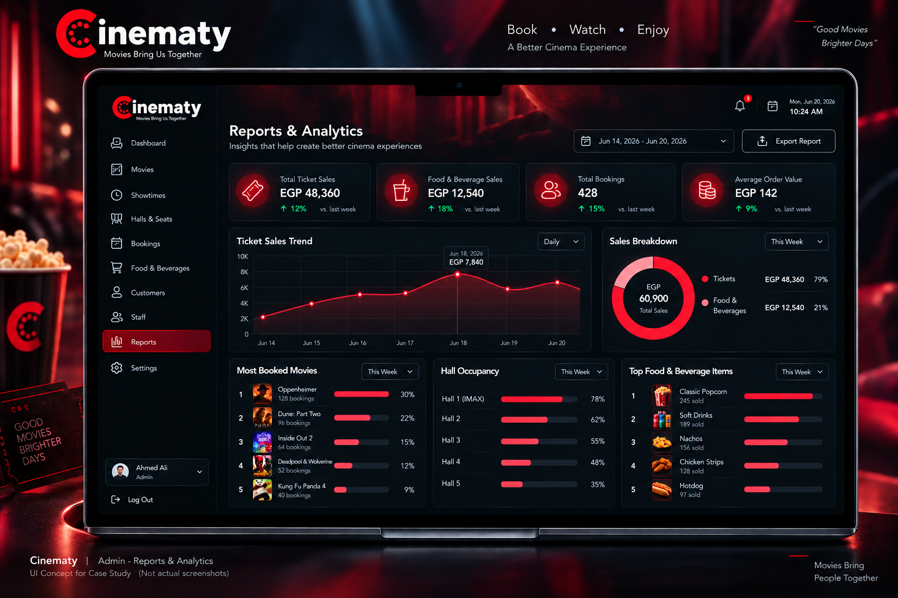

#### Hall & seat-layout management

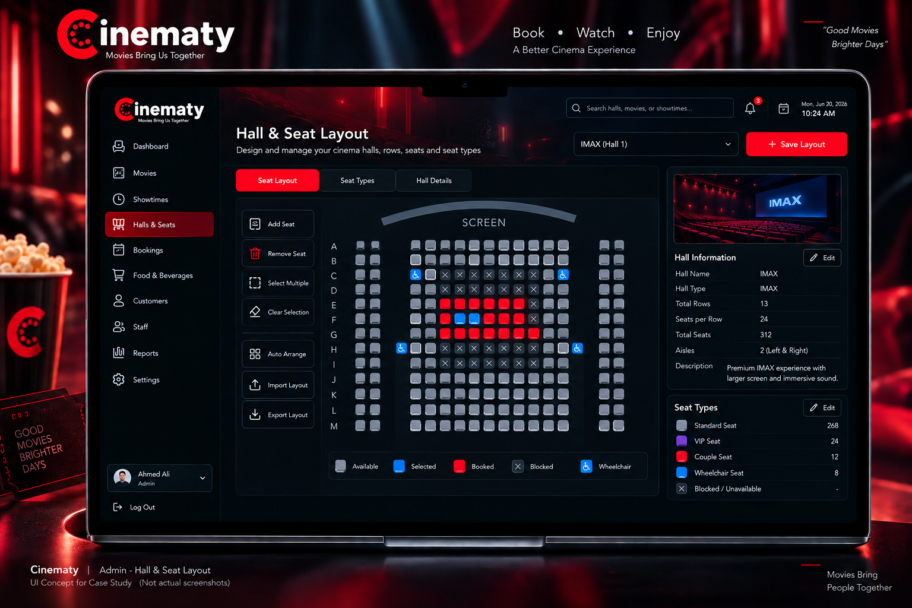

---

### Staff Operations

#### Ticket check-in

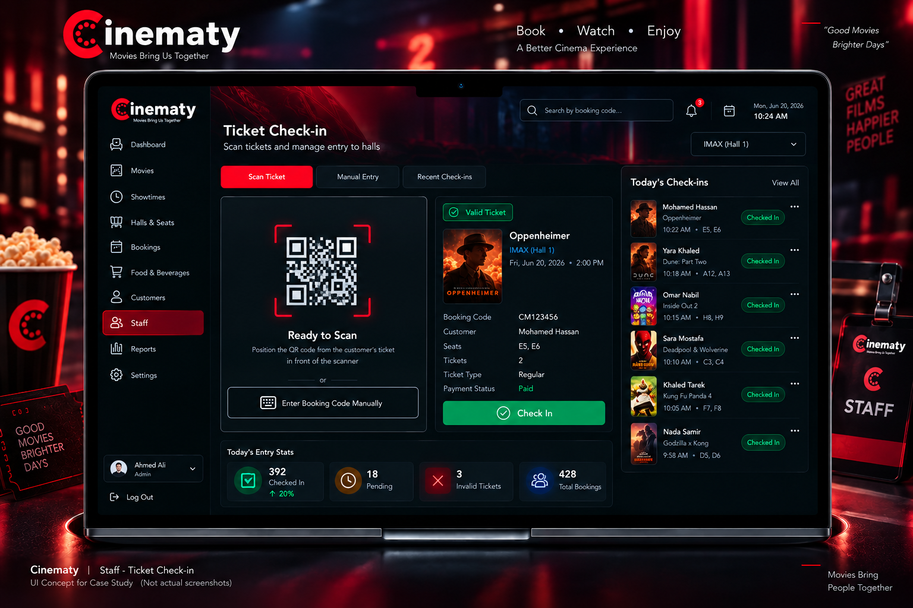

#### Concessions order board

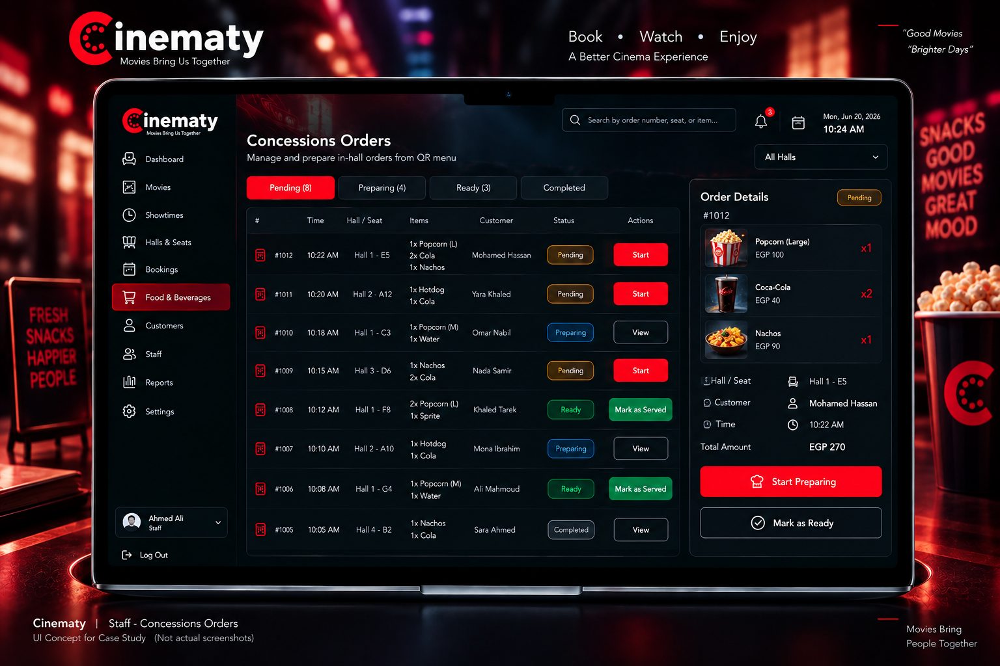

---

## The Engineering Problem

Cinema booking becomes a consistency problem when multiple channels operate on the same finite inventory.

A seat may be selected by a customer while a staff member is also booking on-site. A payment callback may arrive after a hold expires. A ticket may be scanned twice. A realtime connection may silently stall. A report must still reflect the historical transaction even after movie or hall metadata changes.

Cinematy therefore treats critical operations as **server-authoritative workflows**, not UI state transitions.

---

## Architecture

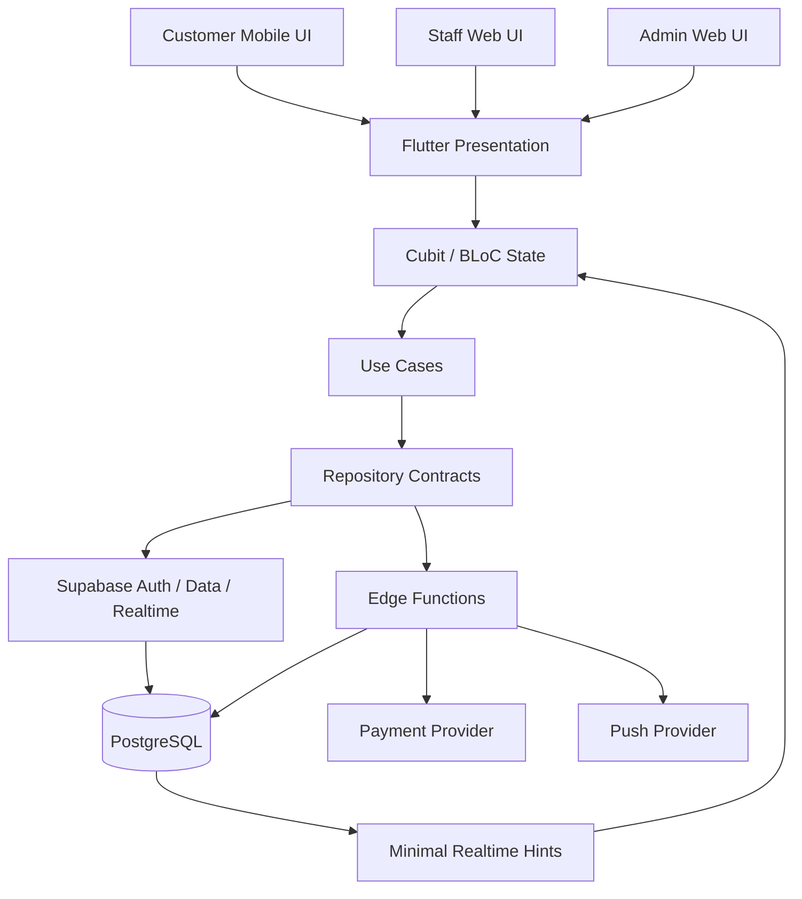

The Flutter codebase follows a **feature-first layered structure** with presentation, domain, data/repository boundaries, dependency injection, and server-backed transactional rules for critical workflows.

### Why PostgreSQL is authoritative

Seat allocation, admission, booking finalization, refunds/report facts, and privileged operations cannot safely depend only on a client screen believing an action succeeded.

The backend is responsible for validating the final state and preserving invariants across customer and staff channels.

---

## Booking & Payment Flow

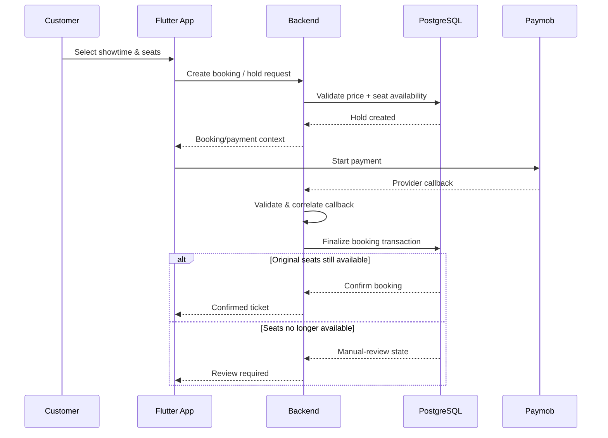

### Late-payment rule

The system does **not** silently substitute different seats when a delayed payment arrives after a hold has expired.

The original seats are confirmed only if they remain available; otherwise the transaction enters a review path.

---

## Live State Without Trusting the Stream

Realtime is treated as a **hint that something changed**, not as the source of truth.

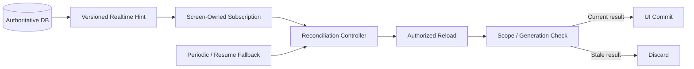

This protects the UI against stale async completions, duplicate reloads, screen disposal, scope changes, silent channel stalls, and reconnect/resume scenarios.

---

## Ticket Admission

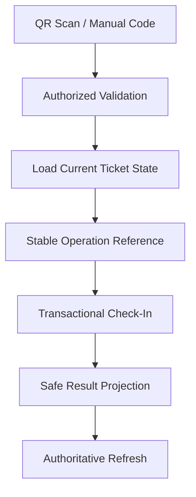

The check-in workflow is designed around the reality that camera duplication, repeated taps, and network response loss can cause the same intended staff action to be submitted more than once.

Replay-aware command references and backend checks help prevent duplicate admission effects.

---

## Key Engineering Decisions

| Decision | Why | Tradeoff |
|---|---|---|
| **PostgreSQL authority for seats, money, and admission** | Keeps customer and staff channels consistent | Requires online backend availability and transactional complexity |
| **Provider-confirmed payment semantics** | Client navigation alone cannot prove payment success | More callback/reconciliation logic |
| **Original-seat late-payment handling** | Avoids silently changing what the customer paid for | Exceptional conflicts require manual review |
| **Realtime hints + authoritative reload** | Reduces data exposure and stale UI risk | Adds extra reads and lifecycle complexity |
| **Scope/generation guards** | Prevents old async work from overwriting new screen state | More controller/state logic and tests |
| **Transactional notification outbox** | Commits business state and notification intent together | Delivery remains at-least-once and requires retry/lease handling |
| **Historical reporting facts/snapshots** | Prevents later catalog edits from rewriting past meaning | Extra schema and backfill complexity |

---

## Engineering Challenges

### 1. Shared seats with delayed payment

A booking hold can expire before the payment provider confirms the transaction.

**Approach:** transactional holds, correlated callbacks, locked finalization, and explicit late-payment review when the original seats are no longer available.

### 2. Duplicate admission and retried staff actions

Repeated scans, repeated taps, and response loss can cause the same logical command to arrive multiple times.

**Approach:** stable operation references, backend eligibility checks, transactional mutation, and authoritative post-success refresh.

### 3. Reliable live views without exposing business rows

Directly subscribing to operational tables can reveal unnecessary data or leave screens stale when sockets silently stop delivering events.

**Approach:** minimal realtime hints, narrow subscriptions, authorized reloads, periodic fallback reconciliation, and stale-result rejection.

### 4. Historical reports after edits and refunds

A report should not reinterpret old transactions simply because a movie, hall, or catalog value changes later.

**Approach:** historical facts/snapshots, trusted event timestamps, server-side date boundaries, and strict response/filter validation.

### 5. Release confidence

A large suite and many implemented features do not automatically make a release qualified.

**Approach:** release evidence contracts, candidate hashing, sanitized artifacts, fail-closed qualification rules, and explicit pending runtime gates.

---

## Technology Stack

| Area | Technology |
|---|---|
| UI | Flutter / Dart |
| State management | Cubit / BLoC |
| Navigation | go_router |
| Dependency injection | GetIt |
| Backend | Supabase |
| Database | PostgreSQL |
| Server workflows | TypeScript / Deno Edge Functions |
| Online payments | Paymob workflow |
| Realtime | Supabase Realtime + reconciliation layer |
| Notifications | Firebase-related push architecture |
| Localization | Arabic + English |
| CI / validation | GitHub Actions + Flutter / Deno / release-contract tooling |

---

## Verified Repository Evidence

The following values come from the repository audit and are **not business/adoption metrics**:

| Metric | Verified value |
|---|---:|
| Feature directories | **8** |
| Router declarations | **44** |
| Application roles | **3** |
| Languages | **2** |
| SQL migration files | **23** |
| Declared application tables | **48** |
| Edge Function entrypoints | **24** |
| Test-suite files | **218** |
| Flutter unit/widget test files | **137** |
| Flutter integration-test files | **9** |
| Backend Deno tests passed locally | **237** |
| Selected release-contract tests passed locally | **43** |

> `44 route declarations` does **not** mean 44 complete polished screens.  
> `48 declared tables` describes migration source, not a verified live production database.

---

## Testing & Quality — Audit Snapshot

**Audit date: 2026-09-20**

The repository contains a broad multilayer test suite covering domain rules, repositories, state management, widgets, security/database contracts, release tooling, and integration journeys.

Local audit observations:

- **237 backend Deno tests passed, 0 failed** across 35 files.
- **43 selected release-contract tests passed, 0 failed** across 5 files.
- Flutter reported **617 passed, 2 skipped, 19 failures** under Flutter **3.32.8 / Dart 3.8.1**.
- The repository's release policy pins a newer Flutter/Dart toolchain, so this Flutter run is **not** a valid green release-candidate result.
- `flutter analyze` also failed under the installed SDK because of API incompatibilities around `DropdownButtonFormField.initialValue`.
- pgTAP/database execution, real provider E2E, device/browser qualification, load testing, and disaster-recovery rehearsal were not completed in this audit.

The correct public interpretation is:

> **Broad automated testing exists, backend contracts passed locally, but the full product is not yet release-qualified.**

---

## Current Status

**Advanced Development · Release Hardening**

Cinematy has substantial implemented functionality across booking, staff operations, concessions, administration, notifications, and reporting.

Final product qualification is **not complete**. The current evidence does not establish production deployment, active customers, app-store availability, completed load qualification, completed disaster-recovery rehearsal, real payment-provider E2E qualification, complete physical-device/browser qualification, or a fully green pinned-toolchain release candidate.

---

## Current Limitations

This case study intentionally does **not** claim:

- full offline booking, admission, or payment,
- automatic seat substitution for late payment,
- exactly-once provider delivery,
- completed production refund/manual-review tooling,
- direct payment-terminal or thermal-printer integration,
- native desktop product support,
- production scale or business impact,
- a fully green release suite.

---

## Repository Status vs. Product Status

This public repository demonstrates the engineering story.

It does **not** imply that the private product repository is open source, deployed, commercially operating, or approved for production release.

---

## Source Code Notice

> Cinematy is presented here as an engineering case study. The production repository and proprietary implementation remain private. This showcase contains only sanitized architecture, workflow explanations, synthetic UI concepts, and verified technical evidence.

---

## Case Study Asset Note

All screenshots shown here are **UI concepts created specifically for this case study**.

They are intended to communicate the current product direction, represent implemented workflows, serve as a future UI target, and make the engineering story easier to evaluate.

They must not be described as captured production screens.

---

### Cinematy

**Book · Watch · Enjoy**

*Movies Bring Us Together*

